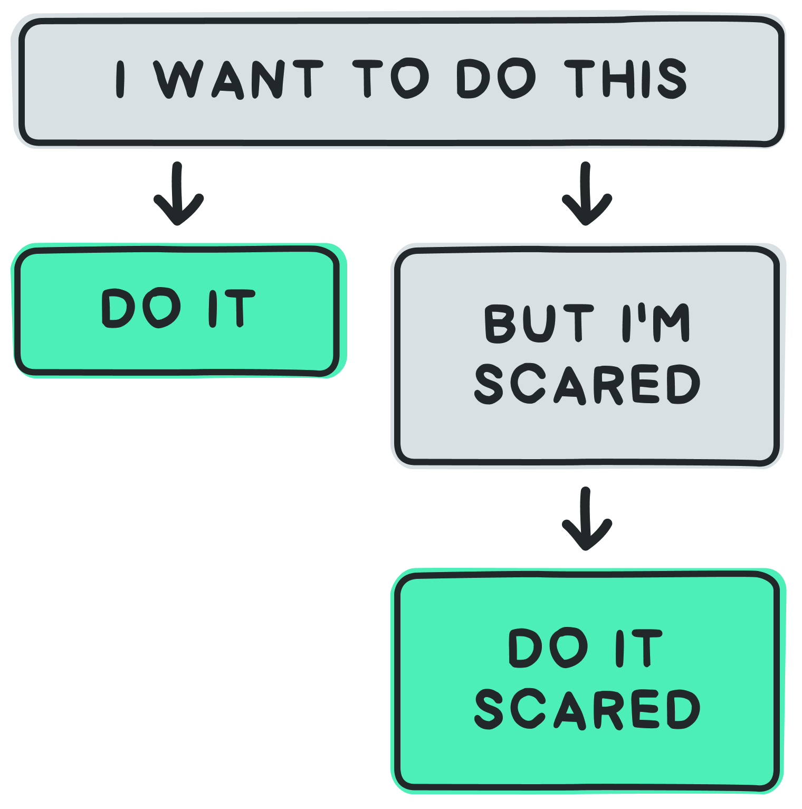

- This podcast with Kristen Ulmer shaped my understanding the nature of fear
  https://open.spotify.com/episode/2mo8Wabq1uQtHpyV5QbPo2
- The awful feeling we are feeling isn't our fear. It's the resistance to our fear. Resistance to fear leads to suffering. [[Pain is not optional but suffering is]]
- Simply having a fear does not dictate how we conduct our life. It does however give us additional input: Fear show us what we value, what's important to us. [[Knowing what's important is key to decision making]]
- Fear is not a problem to be solved. [[Acceptance happens when we stop viewing something as a problem to be solved]]
- This is one application of the realisation that [[Our relation to reality determines our degree of freedom]].
- How to act on this? Example for a parent-child interaction:
	- Child: I don't want to go on the water slide. It's scary!
	- Father: You're right. Isn't it scary. Look how big it is. Are you in the mood to feel fear?
-
- A different description of the process that needs to happen is integration. "Integrating fear into ones conception of self beats overcoming fear" would be the title rephrased title for this page.
	- I realised this after understanding that [[Balance implies tension, harmony implies integration]].
-
- Here is a chart that helps to decide what to do if you want to do something:
	- {:height 532, :width 420}
	- Source: https://techflection.nl/