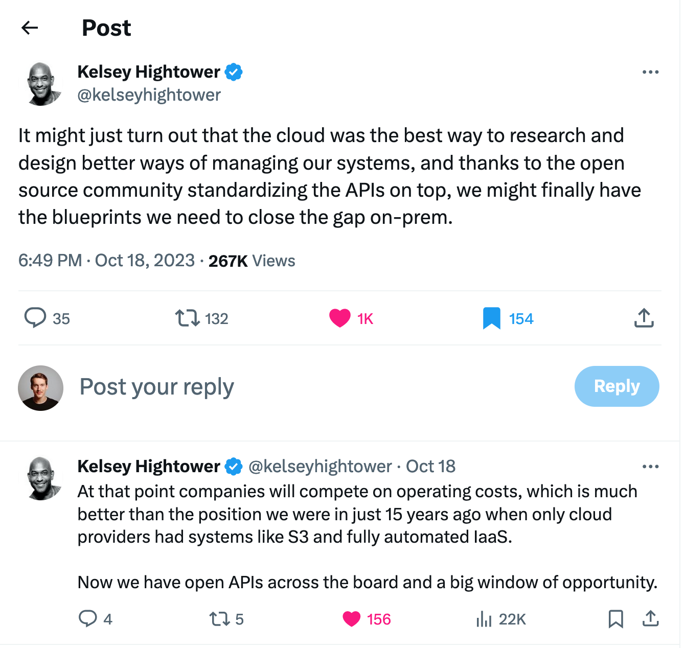

- Well said in this post by Kelsey Hightower:
	- > It might just turn out that the cloud was the best way to research and design better ways of managing our systems, and thanks to the open source community standardizing the APIs on top, we might finally have the blueprints we need to close the gap on-prem.
	- > At that point companies will compete on operating costs, which is much better than the position we were in just 15 years ago when only cloud providers had systems like S3 and fully automated IaaS. 
	  Now we have open APIs across the board and a big window of opportunity.
	- 