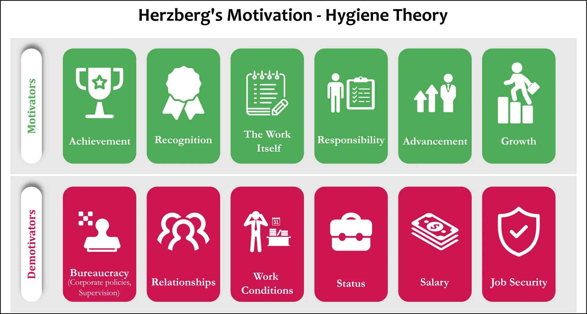

- Also called Herzberg's Two Factor Theory. it aims to describe the inputs and function that determine job motivation.
- The domain of the motivation function is disconnected ([[Understanding the topology of a space can disproportionally increase understanding]]). Satisfying Hygiene factors is important but it's not useful to maximise for them. Hygiene factors will not sustainably energise you. The maximization efforts should focus on Motivator factors. [[Managing energy beats managing time]]
- The domain of the motivation function is disconnected ([[Understanding the topology of a space can disproportionally increase understanding]]). Satisfying Hygiene factors is important but it's not useful to maximise for them. Hygiene factors will not sustainably energise you. The maximization efforts should focus on Motivator factors.
	- [[Knowing what's important is key to decision making]]
	- {:height 409, :width 748}
- [[The Psychology of Money: Timeless Lessons on Wealth, Greed, and Happiness]] has more on this.