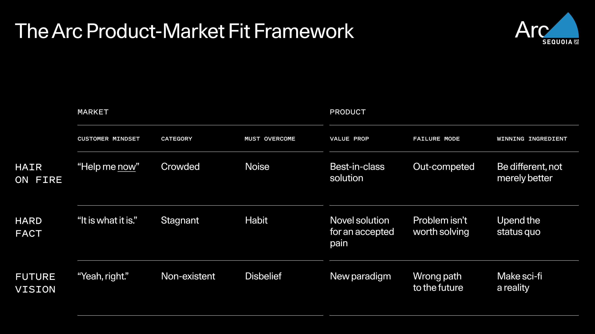

- > Ultimately, product-market fit is about your product’s place in the world. There are different aspects to how your product fits into the world that you could hone in on—competitive landscape, the technical merits of your product, etc. We think the best way is to start by focusing on how the **_customer_ _relates to the problem_** your product solves. [⤴️](https://omnivore.app/me/https-www-sequoiacap-com-article-pmf-framework-18edc94dce7#1c5af5aa-76c0-48b5-974a-3f2a90f4c745)
- {:height 446, :width 770}
- Source: [The Arc Product-Market Fit Framework | Sequoia Capital](https://omnivore.app/me/https-www-sequoiacap-com-article-pmf-framework-18edc94dce7)
  site:: [Sequoia Capital](https://www.sequoiacap.com/article/pmf-framework/)
  author:: Team Sequoia
  date-saved:: [[Apr 14th, 2024]]
  date-published:: [[Apr 9th, 2024]]