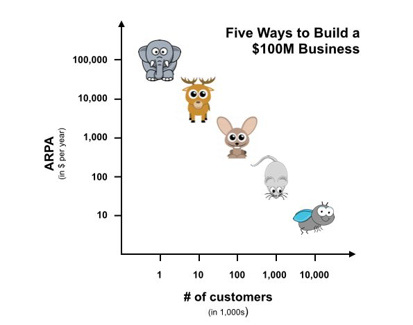

- If you hunt rabbits, this might be Marketing.
-
- The average contract value determines how many deals you need to make to reach a given valuation.
	- Shorthand term for this: elephants, deers, rabbits, mice, flies
	- {:height 378, :width 470}
- For large deals, sales and relationship building are leading.
- For mass market products, adoption must happen without putting much effort into individual sales.
- [Five ways to build a $100 million business](https://christophjanz.blogspot.com/2014/10/five-ways-to-build-100-million-business.html)
  site:: [christophjanz.blogspot.com](http://christophjanz.blogspot.com/2014/10/five-ways-to-build-100-million-business.html)
  date-saved:: [[Apr 8th, 2024]]
  date-published:: [[Oct 5th, 2014]]
	- ### Highlights
		- > if you have a good solution for a significant problem experienced by large enterprises, building a $100 million business is relatively straightforward. After all, you only need 1,000 customers, and the $100k you need from each of them is less than they spend on the salary of one executive. I think there's a lot of truth in that. [⤴️](https://omnivore.app/me/http-christophjanz-blogspot-com-2014-10-five-ways-to-build-100-m-18ebf5273d0#31f2bd89-ff70-42e3-a052-8d6dc2a3f425)
		- [[Consumers don’t like paying for stuff]], so catching flies means you need attention from a lot of flies.