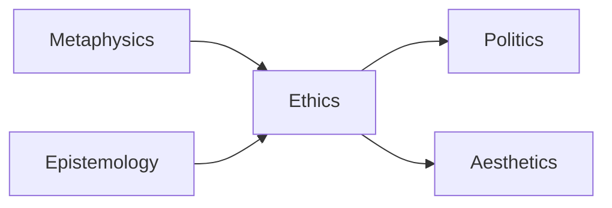

icon:: 🙎‍♂️

- Lecture "Introduction to Objectivism" {{video https://www.youtube.com/watch?v=hlJD0i_WwdQ&t=261s}}
- Peikoff divides philosophy into five categories. They are connected

-  Metaphysics: There is a reality. It exists independent of consciousness, i.e. objectively.
	- The natural world interacts according to cause and effect.
	- Human will is a form of cause.
- Epistemology:
	- Reason is the only means of knowledge (expressed as explanations).
		- Contrast to that to mysticism "you get a direct, unmediated insight into reality" (revelation, intuition)
	- Our senses give us access to reality.
	- Concepts are our objective way of ordering knowledge.
	- Logic is the method of reason. Core: [[There are no contradictions. Check your premises]]
	- Truth is absolute.
		- Contrast with Sceptics: "We can't determine if there is objective truth."
- Ethics
	- Selfishness is good.
- Politics
	- Start with rights of human beings.
	- [[Life, liberty, property]].
	- Capitalism
	- Police (because competition about violence leads to more violence), Military (defense from outside), Court Systems (solving disputes without falling back on rules of force)
- Aesthetics
	- value oriented art: "Art should present the world according to as it could be and as it should be."
		- could be: stay within the bounds of reality
		- should be: be an inspiration
- Ayn Rand and he consider Immanuel Kant the most influential mystic of the last few hundred years.