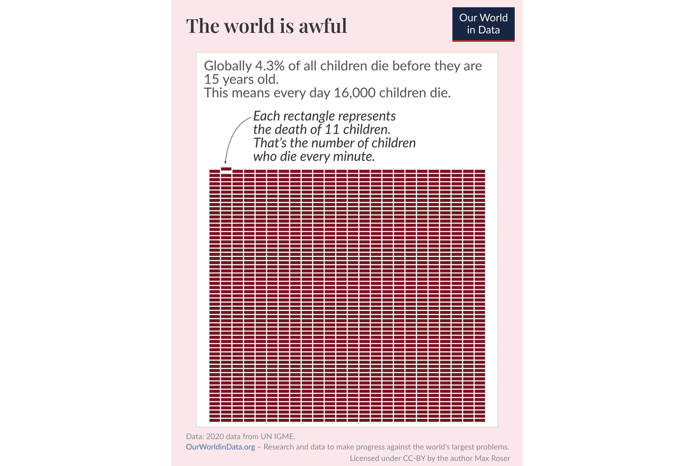
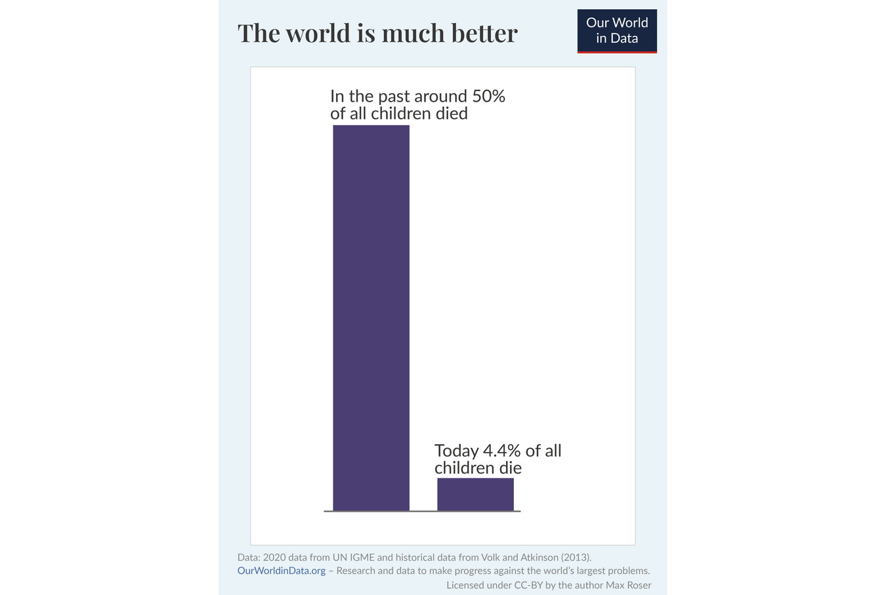
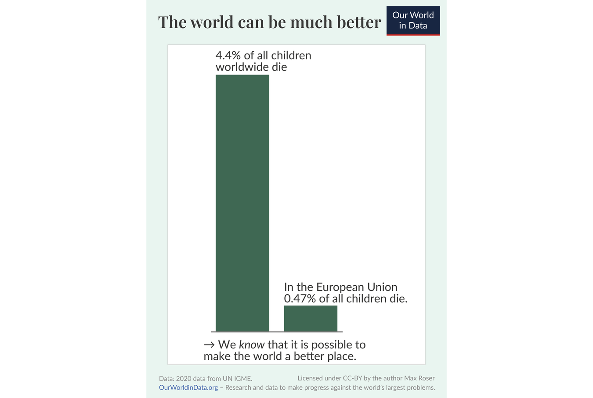

- David Deutsch writes:
	- Problems are inevitable (It is inevitable that we face problems, but no particular problem is inevitable. We survive, and thrive, by solving each problem as it comes up. And, since the human ability to transform nature is limited only by the laws of physics, none of the endless stream of problems will ever constitute an impassable barrier.)
	- **Problems are inevitable**. It is inevitable that we face problems, but no particular problem is inevitable. We survive, and thrive, by solving each problem as it comes up. And, since the human ability to transform nature is limited only by the laws of physics, none of the endless stream of problems will ever constitute an impassable barrier. [[The creation of a new explanation always starts with a problem]]
	- **Problems are soluble**. The right knowledge would solve them. It is not, of course, that we can possess knowledge just by wishing for it; but it is in principle accessible to us through good explanations. [[We create better explanations through conjecture, criticism and testing]]
- Not everything is a problem to be solved. Some things are literally "natural laws", so e.g. traveling faster than light is not a problem to be solved but simply how things are. [[Acceptance happens when we stop viewing something as a problem to be solved]].
- My earliest contact with a convincingly laid out optimistic worldview was "Growth mindset" by Carols Dweck.
- Before I read David Deutsch I was more leaning to Anarcho-primitivism. Now the optimistic mindset of Transhumanism are more appealing to me.
- I also found the attributes Definite/Indefinite useful for thinking about Optimism/Pessimism. (See Zero To One)
	- **Indefinite Pessimism.** “An *indefinite pessimist* looks out onto a bleak future, but he has no idea what to do about it.”
	- **Definite Pessimism.** “A *definite pessimist* believes the future can be known, but since it will be bleak, he must prepare for it.”
	- **Indefinite Optimism.** “To an *indefinite optimist*,
	   the future will be better, but he doesn’t know how exactly, so he won’t
	   make any specific plans. He expects to profit from the future but sees 
	  no reason to design it concretely.”
	- **Definite Optimism**  The future will be better than
	   the present if you make plans and work to make it better.  “From the 
	  17th century through the 1950s and ’60s, definite optimists led the 
	  Western world. Scientists, engineers, doctors, and businessmen made the 
	  world richer, healthier, and more long-lived than previously 
	  imaginable.” Thiel gives some of the expected examples of the Golden 
	  Gate Bridge (1933-1937), The Manhattan Project (1941-1945), and the 
	  Interstate Highway System (1956-1965).
- https://ourworldindata.org/much-better-awful-can-be-better
	- "The world is awful. The world is much better. The world can be much better." These three statements do not contradict each other. Optimists see that they are all true and see that a better world is possible.
	- The world is awful. 
	- The world is much better. 
	- The world can be much better. 
