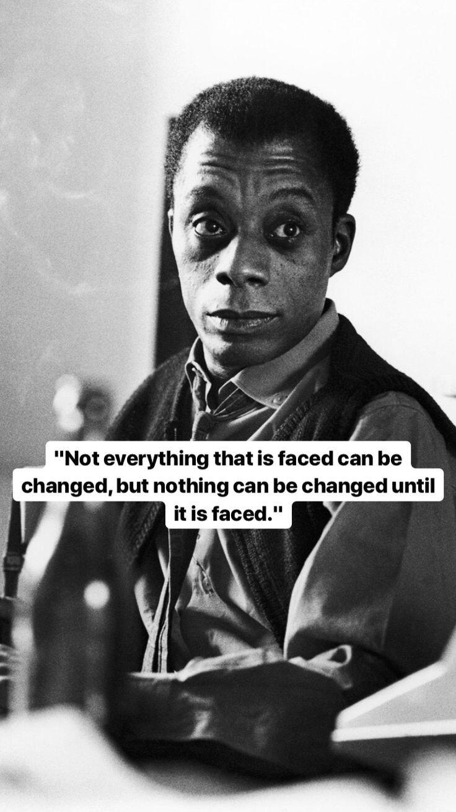

- There are many ways to face reality. I order them from least liberating to most liberating:
	- refusing to seek the truth
	- avoiding (unconscious struggle; fear to acknowledge our own fear) [[Wishful thinking stems from an impulse to minimise surprisal]]
	- resisting (conscious struggle)
	- overcoming (conscious struggle; there's hope to win the fight/solve the problem)
	- facing
	- recognising
	- accepting, make peace with
	- embracing
	-
- For problems **the challenge** to solve the problem is the thing to be embraced (if it is achievable by us). [[Optimists view problems as inevitable and soluble]]. Expressed differently, it means rejecting a pessimist, defeatist view and courageously confronting a problem.
- For things that are outside of our control, embracing means embracing **reality as it is** and that we have to live in this reality.
- {:height 487, :width 276}