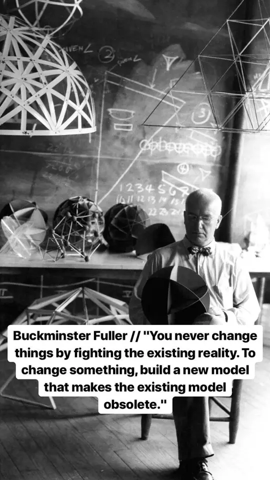

- These phrases often point to reality (even if they do have a distinct meaning):
	- ground truth
	- base level reality
	- substance
	- truth
	- nature of
	- inner logic
	- inner workings
	- things as they really are
	- the situation actually being faced
	- forces at work
	- what's going on here?
	- this is not how things work
	- existence exists
	- [[A is A]]
	- facts
	- data
	- You must be reality oriented - seeing things as they really are without passing judgment.
	  “See it like it is!”
	  Take into account hard-nosed realities affecting everyone. ([Sivers](https://sive.rs/book/NegotiateAnything))
-
-
- LATER I now, as of 2025-02-13, believe that what I describe in the article here is mostly concerning bottom up truth. Bottom up or technical truths can be verified decentrally. Political truths are relative. They change with what people think is true. Both forms of truths are real in a sense of "this is how the world is right now". Will need to adapt this note. More on this in "The network state" from Balaji
-
- Reality is shy—it only reveals itself to those who, like honest scientists, do not wish it to be something else. ([source](https://www.henrikkarlsson.xyz/p/unfolding))
- There are limits to our power. We might miss the necessary knowledge to bring to life the world we envision, see [[Wealth is the set of physical transformations an entity can cause]]. Some things can't be done. If you try to violate a physical laws, you will most certainly fail. In those cases, acceptance is the only way forward. [[Acceptance happens when we stop viewing something as a problem to be solved]].
- “You never change things by fighting the existing reality. To change something, build a new model that makes the existing model obsolete” — Buckminster Fuller
- Avoidance of reality leads to suffering. [[Pain is not optional but suffering is]]. [[Our relation to reality determines our degree of freedom]]
- [Eugene Gendlin](http://en.wikipedia.org/wiki/Eugene%5FGendlin)
	- > What is true is already so.
	  Owning up to it doesn't make it worse. 
	  Not being open about it doesn't make it go away.
	  And because it's true, it is what is there to be interacted with.
	  Anything untrue isn't there to be lived. 
	  People can stand what is true,
	  for they are already enduring it.
- Dune Quote:
	- > The universe is just there; that's the only way a Fedaykin can view it and remain the master of his senses. The universe neither threatens nor promises. It holds things beyond our sway: the fall of a meteor, the eruption of a spiceblow, growing old and dying. These are the realities of this universe and they must be faced regardless of how you feel about them. You cannot fend off such realities with words. They will come at you in their own wordless way and then, then you will understand what is meant by 'life and death'. Understanding this, you will be filled with joy.
	  >
	  Muad'Dib to his Fedaykin
- You can call someone who has a good grasp of how the world works and who uses it to their advantage a hacker:
	- From https://phrack.org/issues/71/17.html#article:
		- > [Hacking's] about knowing how to negotiate your salary (or equity). It's about 
		  knowing why things at the supermarket cost what they do. Or how that awful 
		  shitcoin keeps pumping. And why that dogshit startup got assigned that 
		  insane valuation. And understanding who really pays for it in the end 
		  (hint: it's you).
		  >
		  My point is, it is not just about computers. It's about understanding how 
		  the world works. The world is made up of people. As much as machines keep 
		  society running, those machines are programmed by people--people with 
		  managers, spouses, and children; with wants, needs, and dreams. And it is 
		  about using that knowledge to bring about the change you want to see.
		  >
		  That is what being a hacker is all about.
	- From https://phrack.org/issues/71/1.html#article:
		- > Hacking [...] represents the pinnacle of our abilities as humans to figure out how to use whatever tools we may have, in whatever way we can, to do what we need to do. Hacking is a great equalizer, a common dialect, a spirit that exists within all of us. It has the power to shape the world into one we want to live in.
- {:height 487, :width 276}