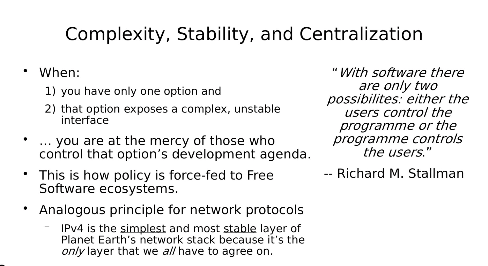

- Because [[Our brains try to minimise surprisal]] we aim to rely on robust systems to meet our core needs and wants. Our more plainly: [[People don’t want to be disrupted]].
- I don't care about the how (it works in the background), I care about the what (I experience).
- Example: Social media
	- I care about my friends and want to stay connected.
	- I care about status and want to appear clever to people I admire.
	- I want to learn useful skills and live a better life.
- Platforms like instagram or twitter bundle what I care about (an interface for connecting with friends or bragging online to strangers, a frictionless onboarding flow, as little cost as possible) with what I don't care about (**how** the above is delivered to me in terms of infrastructure and sofware/protocols).
- The problem starts if what I care about (the interface) gets worse and worse because incentives are not aligned between me and the company that develops it.
	- from talk "sixos: a nix os without systemd" https://media.ccc.de/v/38c3-sixos-a-nix-os-without-systemd#t=461
		- 
- [[Competition keeps incentives between parties on a marketplace aligned]].
- A platform as a bundling of things I care about and things I don't care about is bad if there is no alternative. A platform as a bundling of things that allows me to switch to better alternatives is not a platform, but a protocol with a client.
- I want the thing I care about to be as stable as possible and only change with broad consensus of people like me/similar incentives. Bitcoin/Nostr and protocols like them are an ideal ground to rely upon. Only if the majority of users decide a switch is good, it will happen.
- Thus what we need are [[Protocols, not platforms]].
-
- An interesting formulation of this is "Preparing for the organization as a future adversary". Source: https://dustycloud.org/blog/how-decentralized-is-bluesky/
-
- Another formulation: "self guaranteeing promises"
	- https://stephango.com/self-guarantee
